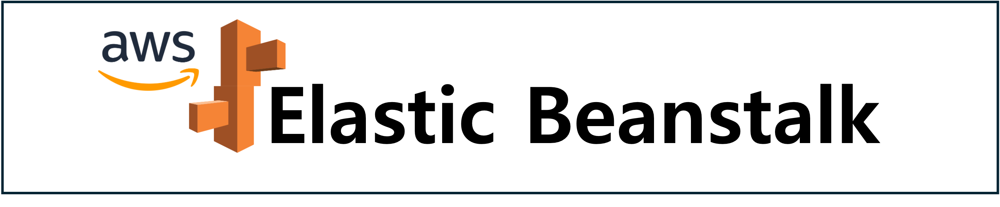
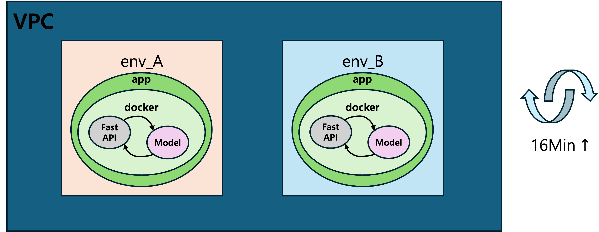
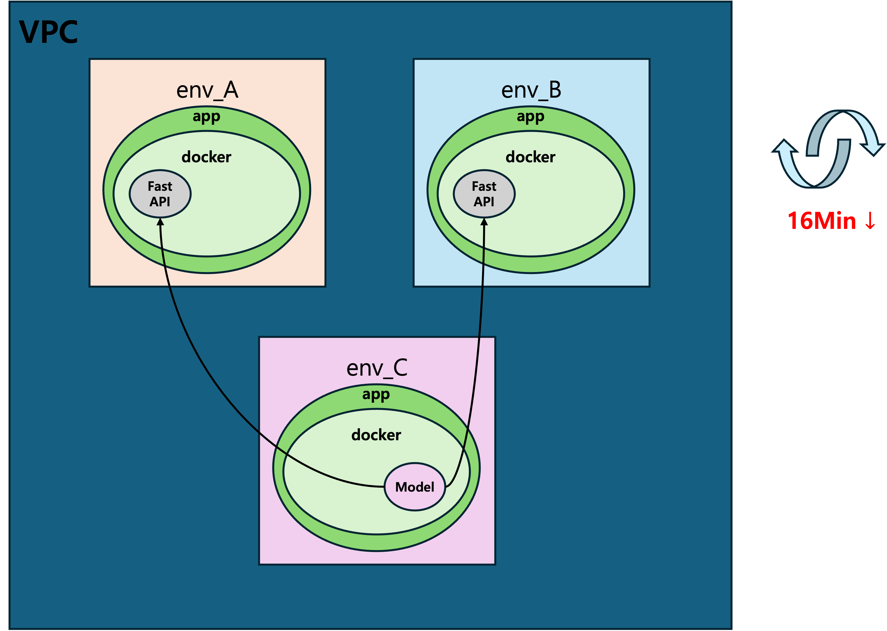

기존 운영하고 있는 엘라스틱 빈스토크 서비스에서 리소스 과부하 문제가 발생 되면 ec2가 자동 추가증설이 되어 문제를 해결해 주고 있는데, ec2내 불필요하게 로드되는 부분이 있어 좀 더 신속한 대응이 어려운 부분이 있다.
그래서 불필요한 부분을 새로운 환경에 분리하여 관리하면 리소스 과부하 문제를 더 신속하게 대처 가능할 것으로 기대되어 작업을 진행하려 한다. 
> ### 엘라스틱 빈스토크 란?
> Elastic Beanstalk를 사용하면 애플리케이션을 실행하는 인프라에 대해 자세히 알지 못해도 AWS Cloud에서 애플리케이션을 신속하게 배포하고 관리할 수 있습니다. Amazon Web Services(AWS)는 100개 이상의 서비스로 구성되어 있으며 각 서비스는 기능 영역을 나타냅니다. 다양한 서비스는 AWS 인프라 관리 방법의 유연성을 제공하는 반면에 어떤 서비스를 사용해야 하고 해당 서비스를 프로비저닝하는 방법을 파악하는 것이 까다로울 수 있습니다. Elastic Beanstalk를 사용하면 선택 또는 제어에 대한 제한 없이 관리 복잡성을 줄일 수 있습니다. 애플리케이션을 업로드하기만 하면 Elastic Beanstalk에서 용량 프로비저닝, 로드 밸런싱, 조정, 애플리케이션 상태 모니터링에 대한 세부 정보를 자동으로 처리합니다.
> 
> 출처: AWS Elastic Beanstalk 개발자 안내서

엘라스틱 빈스토크는 서비스(애플리케이션)를 운영할 때 해당 서비스에 대한 업데이트 또는 유지보수로 인해 업로드 및 배포와 같은 작업들과 서비스 부하에 대응하기 위한 로드밸런싱 기능들을 자동으로 수행해 주며 가장 큰 특징으로 새로운 배포를 하는 동안 서비스 중단 없이 배포할 수 있는 무중단 배포가 가능하다.

엘라스틱 빈스토크 설정에 앞서 익숙해져야 할 용어들이 있다.
> ### 애플리케이션
> Elastic Beanstalk 애플리케이션은 환경, 버전 및 환경 구성을 포함한 Elastic Beanstalk 구성 요소의 논리적 컬렉션입니다. Elastic Beanstalk에서 애플리케이션은 개념적으로 폴더와 유사합니다. AWS Elastic Beanstalk를 사용하면 애플리케이션을 실행하는 모든 리소스를 환경으로 관리할 수 있습니다.
> ### 애플리케이션 버전
> Elastic Beanstalk에서 애플리케이션 버전은 웹 애플리케이션의 배포 가능한 코드의 레이블 지정된 특정 반복을 나타냅니다. 애플리케이션 버전은 Java WAR 파일 등의 배포 가능한 코드가 포함된 Amazon Simple Storage Service(Amazon S3) 객체를 가리킵니다. 애플리케이션 버전은 애플리케이션의 일부입니다. 애플리케이션에는 많은 버전이 있을 수 있고, 각 애플리케이션 버전은 고유합니다. 실행 중인 환경에서 애플리케이션에 이미 업로드한 애플리케이션 버전을 배포하거나 새 애플리케이션 버전을 업로드하고 즉시 배포할 수 있습니다. 여러 애플리케이션 버전을 업로드하여 한 웹 애플리케이션 버전과 다른 버전 간의 차이를 테스트할 수 있습니다.
> ### 환경
> 환경은 애플리케이션 버전을 실행 중인 AWS 리소스 모음입니다. 각 환경은 한 번에 하나의 애플리케이션 버전만 실행하지만 여러 환경에서 동일한 애플리케이션 버전 또는 서로 다른 애플리케이션 버전을 동시에 실행할 수 있습니다. 환경을 생성하면 Elastic Beanstalk에서 사용자가 지정한 애플리케이션 버전을 실행할 AWS 계정에 리소스를 프로비저닝합니다.
>
> 출처: AWS Elastic Beanstalk 개발자 안내서

애플리케이션은 서비스를 개발 했을 때 배포하기 위한 재료들을 하나로 모은 압축된 파일 이라고 생각하면 된다.
구성을 업데이트 하거나 수정된 내용들로 새로 압축하여 배포할 때 그 단위를 버전으로 관리 한다.
이러한 서비스(애플리케이션)의 서버 스팩이나 로드밸런싱 및 보안 관리와 같은 세부적인 설정을 할 수있는 영역을 환경이라고 생각하면 된다.

기존 운영하고 있는 서비스 형태는 두개의 환경이 있고 동일한 애플리케이션 이지만 각기 다른 영역에서 사용되고 있는 형태 이다.
도커 내 첫 번째 컨테이너에는 Fast API가 서비스 되고 있고 두 번째 컨테이너에는 Triton 서버에 올려져 있는 머신러닝 모델이 서비스 되고 있다.
오토스케일링 설정으로 인해 ec2가 증설될 경우 웹 애플리케이션(Fast API)뿐만 아니라 Triton서버와 모델까지 업로드하게 되어 정상화 되기까지 16분 이상이 걸린다.

모델은 업데이트 주기가 엘라스틱 빈스토크 애플리케이션에 비해 상대적으로 길기 때문에 모델을 분리하여 새로운 환경에서 따로 관리하게 되면 기존 환경에서는 애플리케이션을 새로운 버전으로 배포할 때 또는
오토스케일링으로 증설된 새로운 ec2에서 웹 애플리케이션(Fast API)만 로드 하기 때문에 배포 시간 및 오토스케일링 시간이 단축될 것으로 기대된다.

