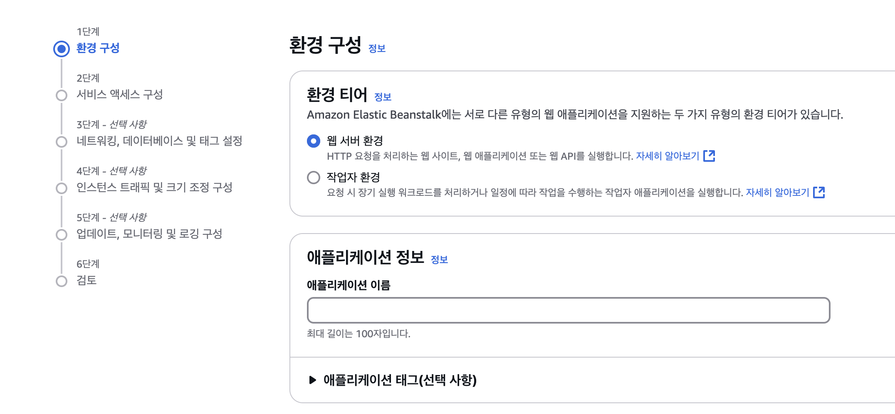

AWS - Elastic Beanstalk - 환경 생성 순으로 접근 시 총 6단계 구성으로 된 생성 과정이다.

> #### 1. 환경 구성
>       환경 티어: 웹 서버 환경
>       애플리케이션 정보: 애플리케이션 이름 기입
>       환경 정보: 기본 값
>       플랫폼: Docker, Docker running on 64bit Amazon Linux 2, Recommended version
>       애플리케이션 코드: 샘플 애플리케이션
>       사전 설정: 사용자 지정 구성
> 
> | 사전 설정 | 설명                | 특징                   |
> |------|-------------------|----------------------|
> | 단일 인스턴스(프리 티어 사용 가능) | 프리 티어 내에서 1개 인스턴스만 실행 가능한 환경| 오토 스케일링 및 로드밸런서 사용 안함|
> | 단일 인스턴스(스팟 인스턴스 사용) | 미사용 용량을 저렴한 가격에 사용| 인스턴스 회수할 경우 갑작스런 종료  |
> | 고가용성 | 다중 인스턴스, 오토 스케일링 및 로드밸런서 포함 | 트래픽 증가에 따라 자동으로 인스턴스 확장 온디맨드 인스턴스만 사용 |
> | 고가용성(스팟 및 온디맨드 인스턴스 사용) | 온디맨드와 스팟 인스턴스를 혼합하여 사용 추가적 트래픽에 스팟 인스턴스 사용 | 비용 절감 효과 크지만 스팟 인스턴스 예고없이 회수 |
> | 사용자 지정 구성 | 직접 인프라와 인스턴스를 구성  | 인스턴스 유형 및 세부내용 직접 설정 |
> 
> #### 2. 서비스 엑세스 구성
> 
> #### 3. 네트워킹, 데이터베이스 및 태그 설정 (선택)
> #### 4. 인스턴스 트래픽 및 크기 조정 구성 (선택)
> #### 5. 업데이트, 모니터링 및 로깅 구성 (선택)
> #### 6. 검토
