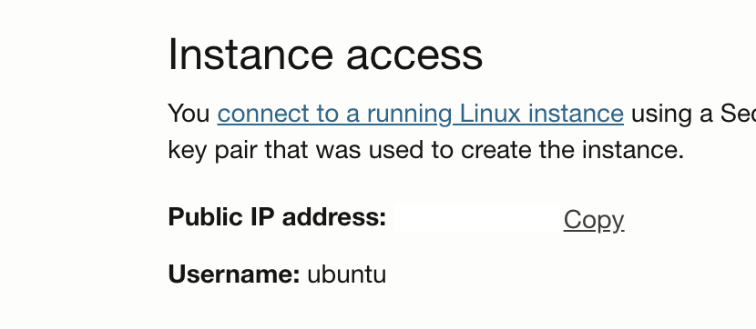
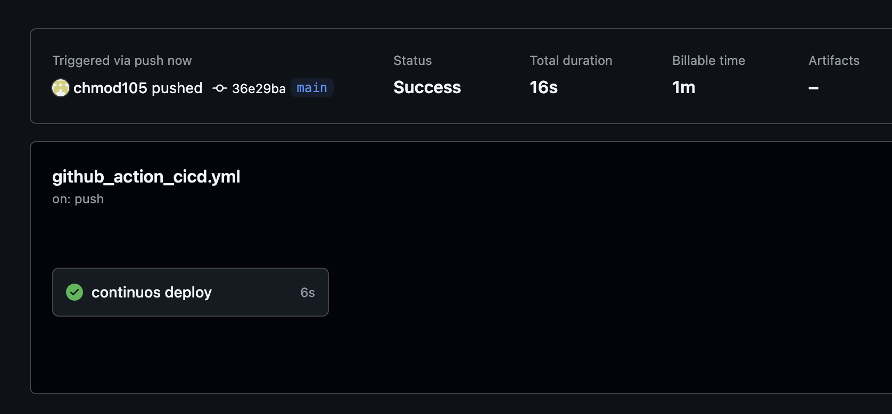

### 클라우드 서비스를 제공하는 대표적인 플랫폼
1. Amazon Web Services (AWS)
2. Microsoft Azure
3. Google Cloud Platform (GCP)
4. Oracle Cloud
5. IBM Cloud

클라우드 서비스는 개인이 운영 유지하기엔 비용적 부담이 굉장히 크다.
무료 평가판을 사용하면 부담은 줄겠지만 대부분 무료 평가판을 이용할 수 있는 기간이 정해져 있다.
유일하게 오라클 클라우드는 무제한 기간으로 무료 평가판을 이용할 수 있는 강점이 있어 클라우드 서버 개인 학습용 및 아주 간단한
프로젝트를 해볼 수 있다.

| 플랫폼          | 무료 기간 | 제공 리소스                                                       | 
|--------------|-------|--------------------------------------------------------------| 
| AWS          | 12개월  | ec2 (750시간 t2.micro)<br/>S3 (5GB)<br/>RDS (750시간 db.t2.micro) |
| Azure        | 90일   | $300 크레딧                                                     |
| GCP          | 30일   | $200 크레딧 + 12개월 프리티어                                         |
| Oracle Cloud | 무제한   | $300 크레딧 + 2Core, 최대 RAM 4GB, SSD 200GB 스팩 무료             |
| IBM Cloud    | 30일   | $200 크레딧 + Lite 계정                                           |

오라클 클라우드 무료 제공 서버스펙을 보면 무료라기엔 누구라도 탐낼 만한 과한 스펙이다. 그래서 대한민국 리전(서울, 춘천) 기준으로 자원이 꽉 차있어 만들기 쉽지 않다.
확실하게 만들 수 있는 스펙은 1Core, 1GB 램 이다. 디스크 같은경우 부팅 스토리지 및 블록 스토리지로 최대 합산 200GB까지 무료 제공한다.

## 오라클 클라우드 무료 서버 생성 과정
> 
> Name 영역은 자유롭게 기입 해준다.

> 
> Image and shape 영역에서 Edit을 누르면 서버 종류와 스팩을 바꿀 수 있다.
> 위 사진 처럼 Ubuntu 22.04 버전에 AMPERE(arm계열 프로세서)를 선택하게 되면 4Core, 24GB의 메모리를 무료로 사용할 수 있다.
> 인기가 많은 스팩이므로 생성 시 나중에 다시 시도하라는 문구가 뜬다. 우리는 바로 생성할 수 있는 낮은 사양 옵션을 선택 한다.

> 
> 위 사진과 같은 사양으로 선택 시 무료 서버를 바로 만들 수 있다.

> 
> private key를 다운로드 받아 준다. ssh접근을 위한 키

> 
> 스토리지 같은 경우 200GB까지 무료 이다.
> 부트 볼륨을 최소 50GB로 잡고 블록 스토리지를 따로 만들어 연결 시킬 수도 있다.

> 
> 하단 Create 버튼을 누르게되면 서버 생성이 시작 된다.
> 몇분 기다리면 RUNNGIN 문구와 함께 초록색 바탕 아이콘이 표시 된다.

> 
> 이제 ssh 접근을 위해 Instance access칸에 보이는 Public IP를 복사 한다.

> 
> ```
> sudo ssh -i private_key.key ubuntu@ip_address
> ```
> 터미널에 명령어를 통해 ssh 접속 한다.
> 위와 같이 접속에 성공하면 무료서버 구축이 완료 되었다.

## Git Repository 연결하기
### CI/CD 란?
CI/CD는 지속적 통합(Continuous Integration, CI) 및 지속적 배포(Continuous Deployment or Continuous Delivery, CD) 를 의미하며, 소프트웨어 개발과 배포 프로세스를 자동화하는 방법론

코드를 작성하고 git에 push를 하면 서비스를 하고 있는 서버내에서도 pull을 직접 실행해 최신 코드를 유지해 준다.
사용하고 있는 IDE에서 코드 작업후 push만 해주면 자동으로 pull을 통해 최신 코드를 배포 해준다면 굉장히 편리할 것이다.

> 
> 
> 
> 구축한 클라우드 서버에 git을 설치 한다.
> ```
> sudo apt update
> sudo apt install git -y
> ```

> 
> 
> 설치 후 `git --version` 을 통해 버전을 확인할 수 있다.

> 
> 
> 서버에서 git에 접근할 수 있도록 사용자 정보를 config파일에 기입해 준다.
> ```
> git config --global user.name user_name
> git config --global user.email user_email
> ```
> 기입 후 git config `--global --list` 를 통해 등록된 정보를 확인할 수 있다.

> 
> 
> 
> 
> 이번엔 git에서 서버에 접근할 수 있도록 서버에서 rsa키를 생성 후 git에 등록할 것 이다.
> ```
> ssh-keygen -t rsa -b 4096 -C user_email
> eval "$(ssh-agent -s)"
> ssh-add ~/.ssh/id_rsa
> ```
> 위 세가지 명령어 기입 후 생성된 rsa키 값을 cat 명령어를 통해 출력하고 출력된 값을 복사 한다.
> ```
> cat ~/.ssh/id_rsa.pub
> ```

> 
> 
> git 페이지로 이동 후 우측 상단 사용자 아이콘 클릭하여 Settings를 누른다.
> 좌측 메뉴중 SSH and GPG keys를 클릭하여 노출된 가운데 메뉴들 중 New SSH key를 클릭하여 복사한 키 값을 Key 항목에 붙여넣는다.
> Title은 자유롭게 적어줘도 된다.

> 
> 
> 등록된 모습

> 
> 
> 다시 터미널로 돌아가 연결이 잘 되었는지 확인해 본다.
> ```
> ssh -T git@github.com
> ```
> 위와 같이 명령어를 기입 했을 때 출력 메세지가 같다면 정상적으로 연결 된것 이다.

> 
>  
> 
> git 페이지에서 서버 ssh연결 정보를 위한 변수를 등록 한다.
> 연동시키고자 하는 Repository로 이동한다 그리고 상단 Settings 메뉴를 클릭후 좌측 메뉴들 중 Secrets and variables - Actions을 클릭 한다.
> New repository secret 버튼을 누르고 Name에는 HOST를 기입 Secret에는 서버 ip주소를 기입 후 Add secret 클릭
> 다시 New repository secret 버튼을 누르고 이번에는 Name에 PRIVATE_KEY 기입 Secret에는 우분투 접속을 위해 다운로드 받은 private key의 내용을 붙여 넣어야한다.
> 메모장이나 서브라임과 같은 텍스트 편집기에 private key를 열면 내용 값이 보인다 복사 후 붙여넣는다.

> 
> 
> 이제 git repository를 서버내 다운로드 받을 차례이다.
> 터미널로 돌아와 git연동을 위한 계정 정보와 추가적인 세팅이 끝났으니
> ```
> git clone git@github.com:username/repository.git
> ```
> 명령어를 통해 repo를 다운로드 받는다.
> 이후 사용하는 IDE를 통해 CICD를 위한 yml파일을 작성할 것 이다.
> Pycharm 기준으로 설명 한다.

> 
> 
> 사용하는 IDE에 git repo를 다운 받는다.
> 
> `.github/workflows/github_action_cicd.yml` 를 생성해 준다.
> yml파일명은 자유롭게 적어도 된다.
> 내용은 main 브런치에 push가 되면 이를 감지하고 deploy작업을 수행 한다. host는 우리가 git 페이지에서 변수로 등록했던 서버의 host값을 불러오고
> key값은 우리가 등록했던 private key값을 불러오게 된다. 이후 서버내 cd project(repo 이름) 명령어를 통해 git 폴더에 접근하여 git pull 명령어를 통해
> git origin으로 부터 업데이트를 받아 최신 내용을 유지하게 된다.
> ```
> name: ci-cd-pipeline
> on:
>   push:
>     branches:
>       - main
> jobs:
>   cd-pipeline:
>     name: continuos deploy
>     runs-on: ubuntu-latest
>     steps:
>       - name: executing remote ssh commands using password
>         uses: appleboy/ssh-action@master
>         with:
>           host: ${{ secrets.HOST }}
>           username: ubuntu
>           key: ${{ secrets.PRIVATE_KEY }}
>           port: 22
>           script: |
>             cd project
>             git pull
> ```
> yml파일 작성 후 push를 해준다.


> 
> 
> 
> 
> push후 바로 git 페이지로 돌아와서 상단 Actions를 눌러보면 CICD가 잘 되는지 확인해 볼 수 있다.
> 위와 같이 노란색 아이콘으로 작업이 진행중임을 나타내고 서버내 정상적으로 배포가 되면 초록색 체크 아이콘으로 변경된다.
> 
> 이로써 오라클 클라우드를 사용하여 무료 서버를 구축하고 git action을 통해 CICD까지 구축이 완료 되었다.
> 구축된 환경을 통해 간단한 서비스 개발을 편리하게 진행할 수 있을 것 이다.