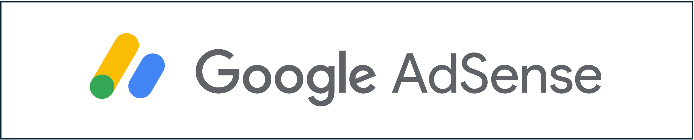
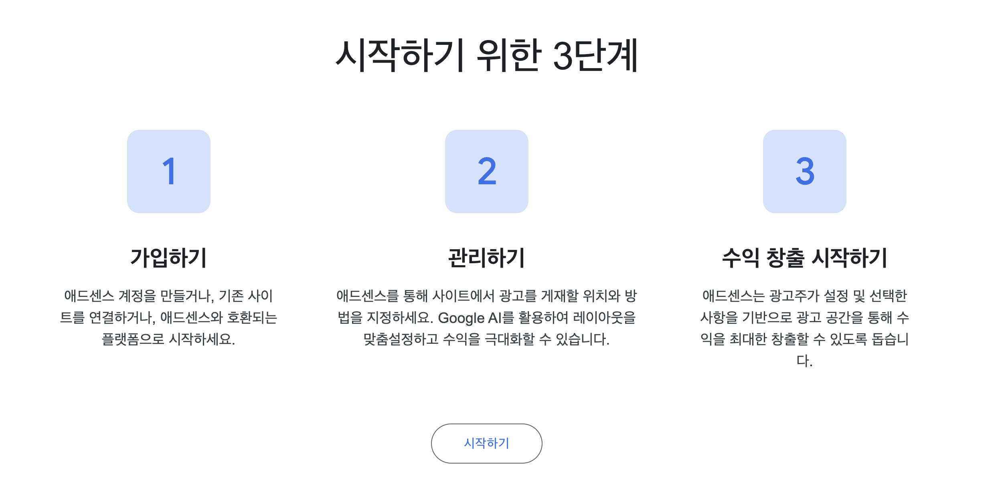
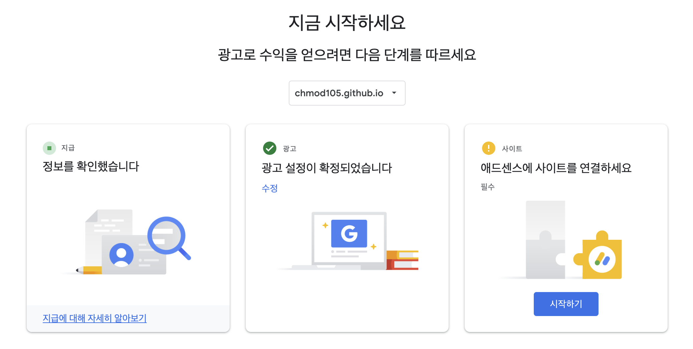
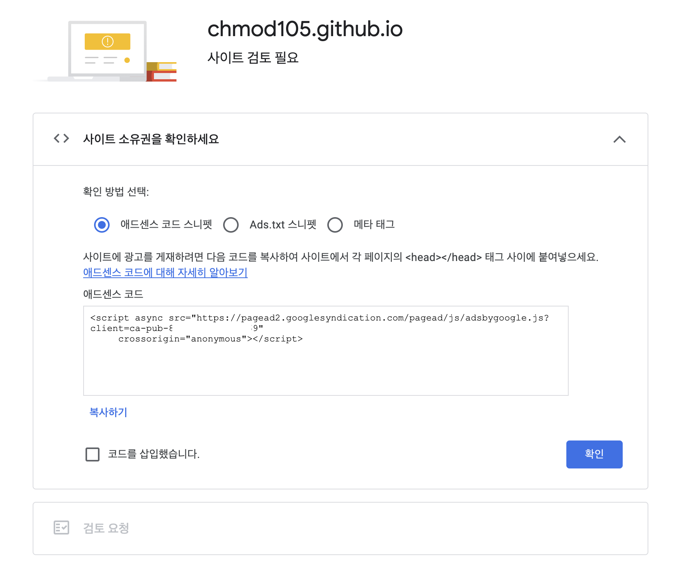
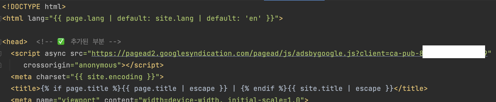
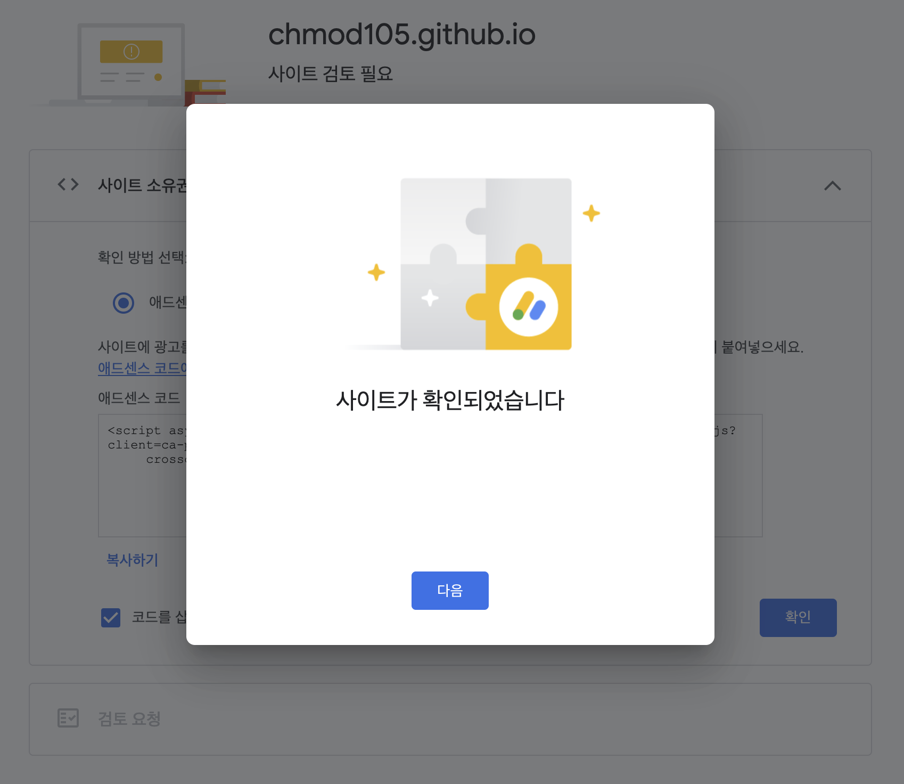
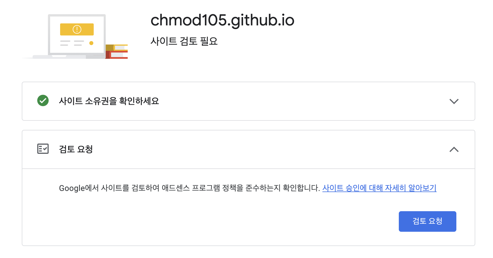
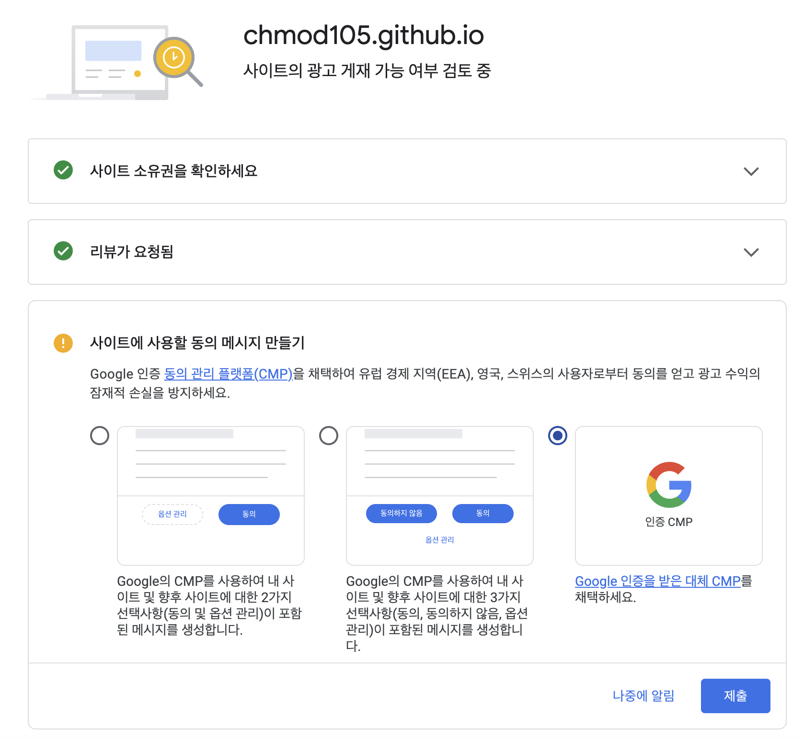
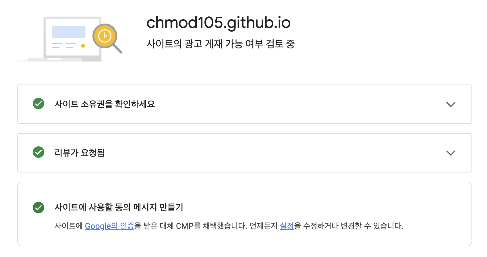

git hub 블로그를 운영하면서 소소한 수익창출을 바램으로 구글 애드센스 신청을 해보았다. 이 과정을 간단하게 공유하려 한다.
다른 사이트나 블로그 플랫폼 보다 git hub 블로그가 승인받기 어렵다고 한다. 이유는 기본 도메인 io가 승인나기 쉽지 않다고 한다.
그래서 도메인만 바꾸고 신청하면 좀 더 나은 가능성이 있다고 한다. 구글 애드센스 신청 난이도는 굉장히 낮지만 애드고시라고 불리울만큼 승인이 쉽지 않다.
한번 승인 받았던 경험자로써의 팁은 꾸준히 블로그 또는 사이트를 관리하면서 미승인 통보를 받을 때 마다 바로 재신청을하면 언젠가는 승인이 난다.
이전에 승인 받았을 때 아무 수정없이 계속 재신청을 하였는데 6회만에 승인 받았었다. 명확한 승인 기준은 없는것 같다.
> ### 구글 애드센스 란?
> 구글 애드센스(Google AdSense)는 광고주를 위한 구글 애즈와 대비되는 구글의 광고 프로그램이다. 웹사이트 소유자는 애드센스에 가입함으로써 광고 수익을 구글과 나눌 수 있다. 광고 수익은 사용자가 애드센스 광고를 클릭함으로써 광고 게시자는 구글에 광고비를 지급하고, 구글은 그렇게 적립된 광고비를 웹사이트 제작자와 나누어 갖는다. 애드센스는 구글에 가입된 광고풀 가운데 웹페이지와 가장 연관성이 높은 광고가 나오게 되지만, 그렇지 못한 경우에 공익광고가 나오게 된다. 공익광고는 사용자가 클릭을 했다고 해도 수익이 생기지 않는다.
> 경쟁 서비스로 마이크로소프트의 마이크로소프트 퍼브센터가 있다.
> 
> 출처: 위키백과

> 
> 
> [Google Adsense] 사이트에 들어가 시작하기를 눌러 준다.

> 
> 
> 지급, 광고, 사이트 총 세단계가 있다.
> 첫 번째 지급에서는 개인 주소정보를 적는다. 나중에 광고 정산비용을 지급 받기 위해 계좌 인증하는 단계에서 직접 우편물로 받는 내용이 있으므로 정확히 입력 해줘야 한다.
> 두 번째로 광고 설정이다. 나중에 기호에 맞게 설정할 수 있으므로 자동 광고를 선택하고 적용 한다.
> 세 번째로 사이트와의 연결 이다.

> 
> 
> 
> 애드센스 코드 스니펫의 코드를 블로그 또는 웹 사이트 <head> 영역에 삽입해 준다.

> 
> 
> 코드를 삽입했습니다 체크 후 확인을 누르면 사이트가 확인되었습니다 메세지가 출력 된다. 정상적으로 <head>영역에 해당 코드가 삽입되지 않으면 사이트 확인이 안된다.

> 
> 
> 
> 
> 검토 요청을 눌러주고 사이트에 사용할 동의 메시지 만들기는 자유롭게 선택 후 제출을 클릭 한다.
> 세가지 항목이 초록색 체크 아이콘으로 바뀌면서 이제 애드센스 신청은 완료 되었다. 보통 하루 이틀정도면 메일로 승인 여부를 알려 준다.
> 앞서 말한대로 한 번에 승인나기는 쉽지 않으니 승인 될 때 까지 재신청을 하면 된다.

[Google Adsense]: https://adsense.google.com/intl/ko_kr/start/
